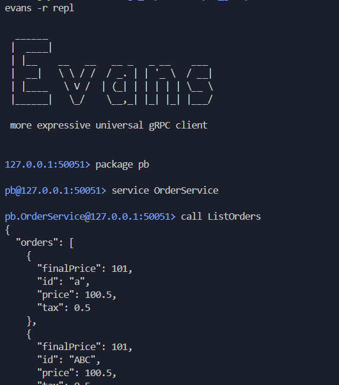

## Desafio Clean Architecture

Desafio proposto pela pós graduaçáo em Golang (Go expert da *Fullcycle.com.br*)

Neste desafio era necessário usar um código previamente disponibilizado e implementar a listagem de ordens.

O código recebido faz a criação de ordens de serviço super simplificadas apenas com alguns poucos campos de id, preço, taxa e preço final. O intuito disso é manter o foco na implementação da utilização de várias tecnologias vistas ao longo do curso até então.

A funcionalidade exposta (criação de ordens) vem implementada com a possiblidade de interação via três canais: web, Graphql e gRPC.

Faz parte do desafio implementar a listagem das ordens também nos três canais supracitados.

A lógica Core é separada dos canais de interação e a solução completa envolve a utilização de várias tecnologias, docker-compose, rabbitMQ, MySQL, GraphQL, gRPC, Makefile, bibliotecas Go: Viper, protoc, go-wire, SqlC, gqlgen, go migrate e Evans.

A solução final foi a listagem de ordens implementada, exposta na web via `/list`, consultada via grapqh com uma query do tipo: 
```
query listOrders {
  listOrders{
    id
    Price
    Tax
    FinalPrice
  }
}
``` 
e chamada via Evans (client gRPC CLI):
```
call ListOrders
```

Toda vez que a listagem é chamada, (assim como já estava implementada para a criação de order) um evento é enviado para a mensageria (rabbitmq) com a mensagem contendo como payload um JSON com a lista de ordens. (não me parece muito útil entregar todo o conteúdo listado num cenário real, mas para estudo valeu o esforço da implementação).


# Execução
Via Make file com:
```bash
make run 
```
ou manualmente:
```bash
cd cmd/ordersystem
go run main.go wire_gen.go
```
Deve-se ver as seguintes mensagem caso o servidor tenha subido com sucesso:
```
Starting web server on port :8000
Starting gRPC server on port 50051
Starting GraphQL server on port 8080
```

**Nota:** é preciso configurar a fila ou filas no RabbitMQ e o bind da exchange amq.direct para a(s) mesma(s). A mensagem de criação vai com uma key 'created', enquanto a de listagem vai com uma key 'listed'


<br>
<br>

# Implemetação

Abaixo demonstro um registro das alteraçõe feitas para a implementação de listar ordens, separados em Core da aplicação e as formas de acess/clientes Web, Graphql e gRPC.

## Implementação Core

* adicionado variáveis de ambiente para parâmetros do RabbitMQ no arquivo .env 
* adicionado Makefile para uso de migrations (**sql/migrations**)

- caso de uso: **list_orders.go**
- adicionado método `ListAll` em **entity/interface**
- implementado `ListAll` em **order_repository.go**
- adicionado **sqlc**
    - código gerado vai para `infra/sqlc`
    - adicionado sql/queries/orders.sql para definições de queries (somente para listar ordens)
- adicionado sqlgenerate como diretiva no Makefile: `make sqlcgenerate`
- adicionado diretiva db ao Makefile para acesso rápido ao mysql: `make db`
- adicionado evento **OrdersListed**
    - adicionado **event/base.go** com implementação base da interface **pkg/events/EventInterface** para uso em ambos os eventos (**OrderCreated** já existente e o novo **ListedOrders**), com isso a implementação de ambos se tornou apenas a definição da função construtora
- adicionado criação do usecase para listagem de ordens no **wire.go**
- adicionado event handler para OrdersListed, **event/handler/orders_listed_handler.go**
- adicionado RabbitMQ handler para compartilhar a lógica de publicar JSON na fila para ambos os event handlers de orders listed e order created
- arquivo main.go ajustado com o novo usecase de listar ordens passando nas correspondentes chamadas para as implementações WEB, GRPC e GRAPHQL

## implementacao web
- alterado **webserver/order_handler.go**
    - adicionado handler ListAll
    - adicionado uma helper function para lidar com erros: `fail()`
    - struct WebOrderHandler alterada para conter os Use Cases já iniciados ao chamar o New dela:
        - para executá-los agora é só chamar:
            - `h.uc.listOrders.Execute()`
            - `h.uc.createOrder.Execute(dto)`
- adicionado arquivo api/list_orders.http


## implementacao graphql
- foi necessário reiniciar (gqlgen init) a parte the graphql para a geração passar a funcionar
- movido arquivo tools.go para dentro de infra/graph
- adicionado diretiva no Makefile para chamar o gqlgen: `make gqlgen`
- adicionado o ListOrdersUsecase ao **resolver.go**
- implementado método ListOrders no **schema.resolvers.go**

## implementação grpc
- adicionado ListOrders ao OrderService no **order.proto** 
- adicionado implementação de ListOrders ao grpc/service/order_service.go
- adicionado usecase de ListOrders em **grpc/service/order_service.go**
- adicionado diretiva protoc ao Makefile para geração de códigos grpc e protobuf
- adicionado diretiva evans ao Makefile para inicializar o client grpc evans


<br>
<br>
<br>

# Screenshots
Chamada web HTTP ao endpoint `/list`:


Chamada gRPC via client Evans:



Chamada graphQL:


RabbitMQ, filas:
**created** para eventos de criação de ordem e **listed** para eventos de listagem e ordem:


RabbitMQ, payload de listagem de ordens:


RabbitMQ, configuração de bindings da exchange `amq.direct`:


Ordens de teste no MySQL:

**Nota:** como o foco foi na implementação da listagem, as mensagens criadas apenas tiveram o ID alterado (primary key) sem a preocupação com os outros campos. E mesmo assim o valor atribuido não sofreu qualquer critério especial.


Como nota final, digo que precisei renomear o caminho das bibliotecas para apontar para meu github e precisei refazer a parte de inicialização do graphql para que funcionasse. Outros problemas foram resolvidos removendo as versões cravadas no go.mod e executando o go mod tidy. No curso quando o Evans é utilizado, ele já fica no contexto correto do serviço, para mim, todas as vezes precisei definir o pacote e o serviço, para só então conseguir fazer a call corretamente.