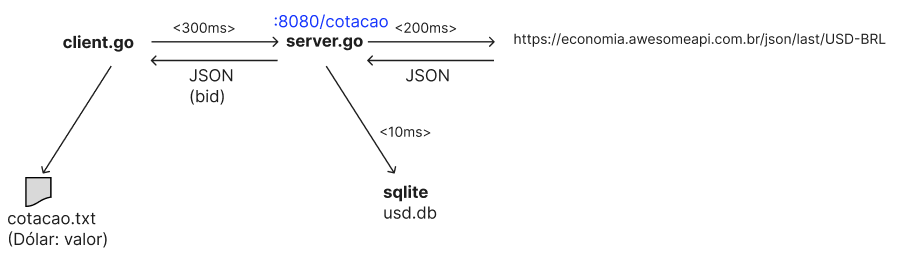
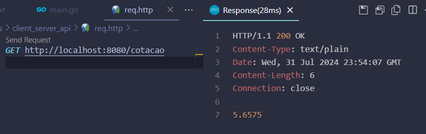
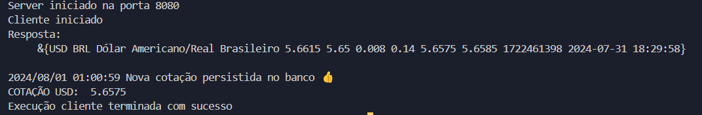
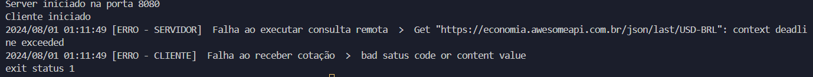
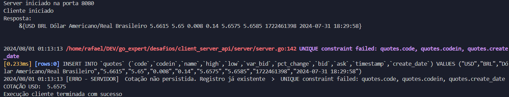

## Desafio client server API

Cenário proposto por desafio de pós graduaçáo em Golang (Go expert da *Fullcycle.com.br*)



Criar dois arquivos, `client.go` e `server.go`

O cliente consome serviço **/cotacao** do servidor, que por sua vez consulta uma API na web.

O servidor salva a resposta em banco de dados e retorna apenas um campo (bid) para ao cliente. Consumindo e respondendo em `JSON`.

O cliente por sua vez salva em um arquivo local.

As comunicações cliente x servidor, servidor x api e servidor x banco de dados, devem possuir timeouts específicados usando o pacote context da golang e mensagens de log devem evidenciar falhas.

O banco de dados sqlite criado é o **usd.db**.
O arquivo criado pelo cliente é o **cotacao.txt**

## Exemplo de chamada direta ao serviço /cotacao no servidor


## Exemplo de execução com sucesso (go run main.go)


## Exemplo de execução com falha (go run main.go)


## Exemplo de execução com log de erro de inserção por causa da cotação já existir no banco - violação de constraint (go run main.go)


## Execução
Considerando utilização via WSL, ambiente linha de comando Linux (bash), acessar o diretório de desafios client_server_api e executar:

```shell 
# apaga arquivo e banco pré existentes~
rm usd.db cotacao.txt
```
e então realizar a execução go main.go:

```shell
go run main.go
```
