# Desafio multithreading e APIs

Cenário proposto por desafio de pós graduaçáo em Golang (Go expert da *Fullcycle.com.br*)


## Proposta

 Usar conhecimentos adquiridos nos módulos *Multithreading* e *APIs* para buscar o resultado mais rápido entre duas APIs distintas.


Serão feitas requisições simultaneamente para:

`https://brasilapi.com.br/api/cep/v1/{cep}`

e

`http://viacep.com.br/ws/{cep}/json/`


## Deve-se:

* Usar resposta da API mais rápida e descartar a mais lenta.

* Exibir o resultado na command line informando de qual API veio.

* Deve haver um timeout de 1 segundo com exibição de erro quando ocorrer.

## Minha solução

A princípio é uma solução estilo "bala de canhão para matar mosquito" mas para fins de aprendizagem está adequada.

Procurei utilizar dos conhecimentos adquiridos nas aulas anteriores para a criação de API com autenticação via JWT, uso de banco de dados com GORM, contexto e concorrência com select para concelar processamento desnecessário, configuração com Viper, middlewares e rotas com o Chi, variáveis de ambiente via arquivo .env e documentação Swagger.


Criei uma api que roda na porta `:8000` para solicitar as informações de CEP, GET `/cep/{cep}`, sendo esta rota  protegida, necessita uso de token para acessar.

Por causa da necessidade de token, existe uma rota POST `/users` para criar um usuário informando email e senha e uma outra, POST `/token` para obter um token de usuário válido (necessitando passar email e senha de um usuário previamente criado).

Conforme solicitado, o serviço de obter detalhes de um CEP faz chamadas à duas APIs distintas, utilizando um contexto que é cancelado assim que uma delas responde. Também há um timeout geral (no contexto) de 1 segundo.
Veja a implementação em `/internal/infra/web/handlers/cep.go` func `getCepInfo`.

A resposta final inclui qual a API de origem da informação retornada.


A API tem documentação auto-gerada à partir de comentários no código utilizando-se do swaggo.


Para executar a API, acesse cmd/server, copie ou renomei o arquivo `.env_example` para `.env` e execute `go run .`.
Considerando WSL (ambiente Linux):

```
cd cmd/server
cp .env_example .env
go run .
```

Então acesse `http://localhost:8000/docs/index.html`

**ATENÇÃO:** No meu caso, eu rodei a aplicação num terminal via WSL, nesse caso, para acessar o localhost via meu navegador e conseguir acessar a aplicação dentro do WSL usando localhost, precisei rodar um comando no cmd do Windows para que fosse possível (sem isso a documentação falha porque está hard-coded localhost, mas o local host da aplicação é diferente do localhost do meu navegador, um está dentro do WSL outro fora - desculpe se isso complica as coisas):

Abra um cmd do Windows e aplique o comando, basicamente isto mapeia a porta local 8000 para a porta do 8000 do WSL (talvez precise rodar como administrador):
```
netsh interface portproxy add v4tov4 listenport=8000 listenaddress=0.0.0.0 connectport=8000 connectaddress=<IP🚩>
```
Subsitua o termo <IP🚩\> acima pelo IP do WSL, no meu caso eu peguei via `ifconfig` no terminal linux em que ia executar o go run, informação inet da interface eth0 (172.31.22.159).
Exemplo da saída do ifconfig:
```
eth0: flags=4163<UP,BROADCAST,RUNNING,MULTICAST>  mtu 1400
        inet 172.31.22.159  netmask 255.255.240.0  broadcast 172.31.31.255
        inet6 fe80::215:5dff:fe4b:69af  prefixlen 64  scopeid 0x20<link>
        ether 00:15:5d:4b:69:af  txqueuelen 1000  (Ethernet)
    ...
```


# Utilização da API


Veja abaixo o exemplo de várias chamadas feitas contra a API utilizando a interface Swagger, para demonstrar diferentes respostas:


## Documentação Swagger
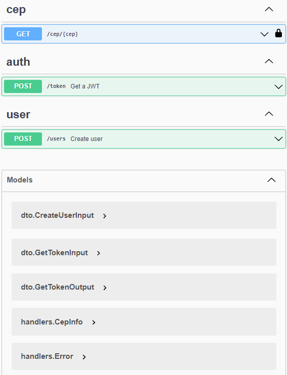

## Resposta da criação de usuário - Sucesso
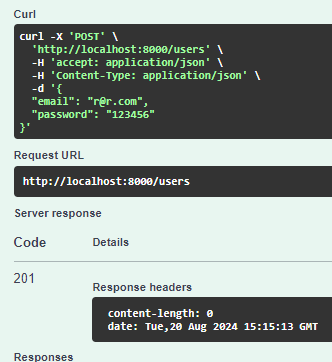

## Resposta da criação de usuário - Falha - já existe
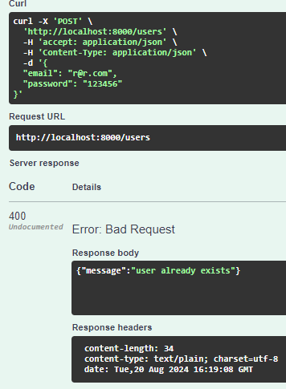

## Resposta da obtenção de um token para o usuário criado
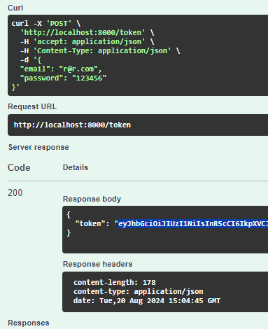

## Resposta (usuário não encontrato)
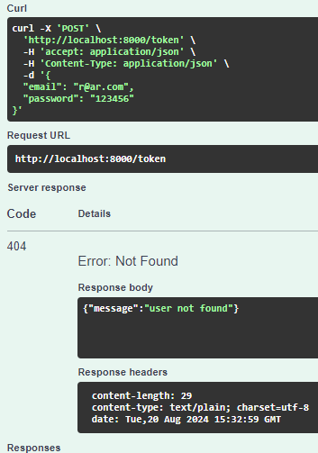

## Resposta CEP inválido 1 (não numérico)
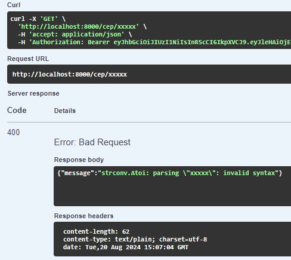

## Resposta CEP inválido 2 (numérico mas inexistente - ViaCEP)
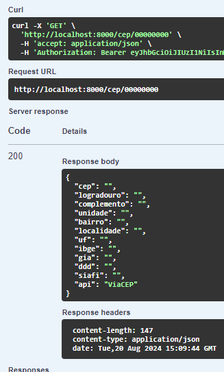

## Resposta CEP inválido 3 (numérico mas inexistente - BrasilAPI)
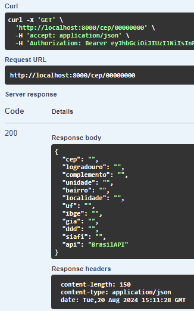

## Resposta Sucesso (BrasilAPI)


## Resposta Sucesso (ViaCEP)


## Resposta (timeout)
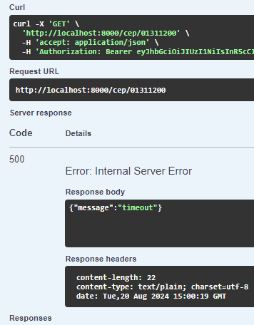

## Resposta (token expirado)
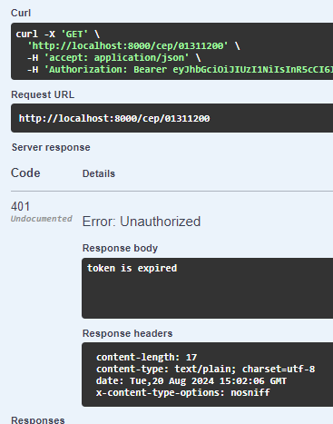

## Resposta (token inválido)
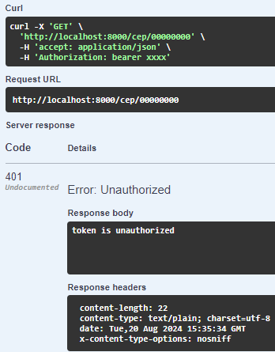


